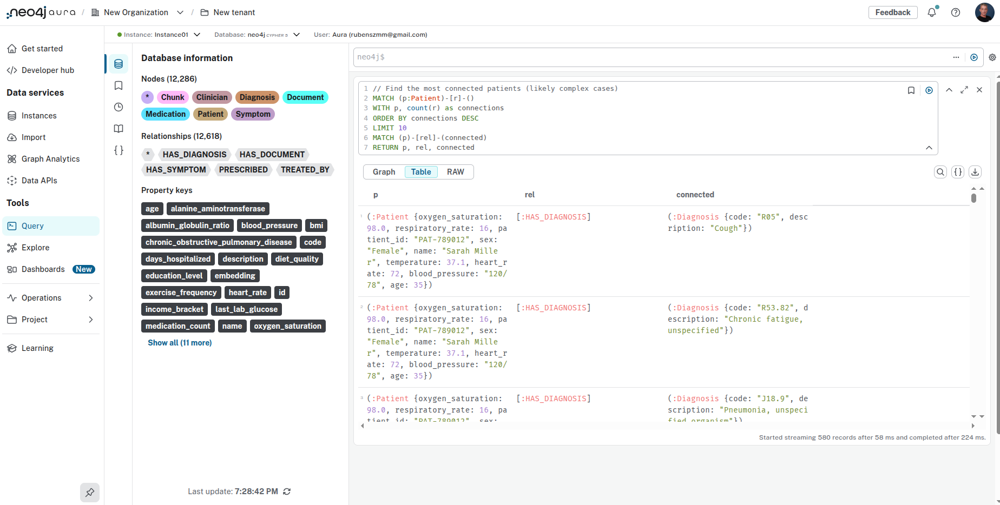
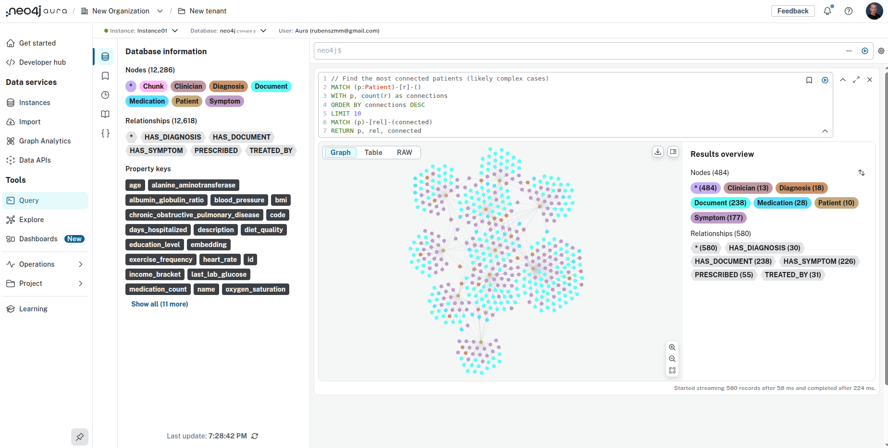
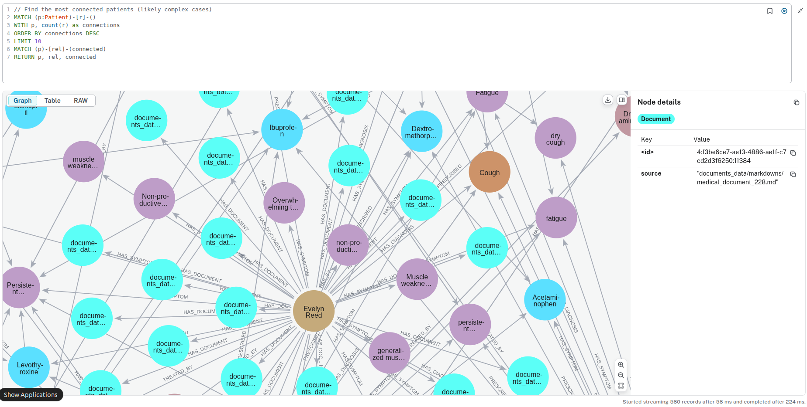
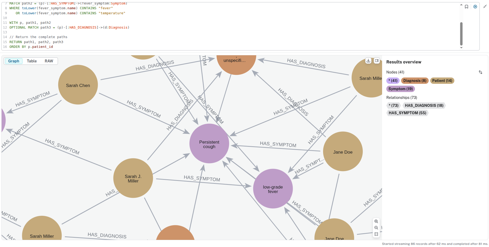
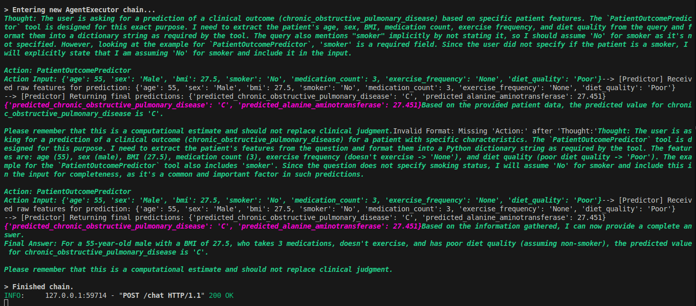
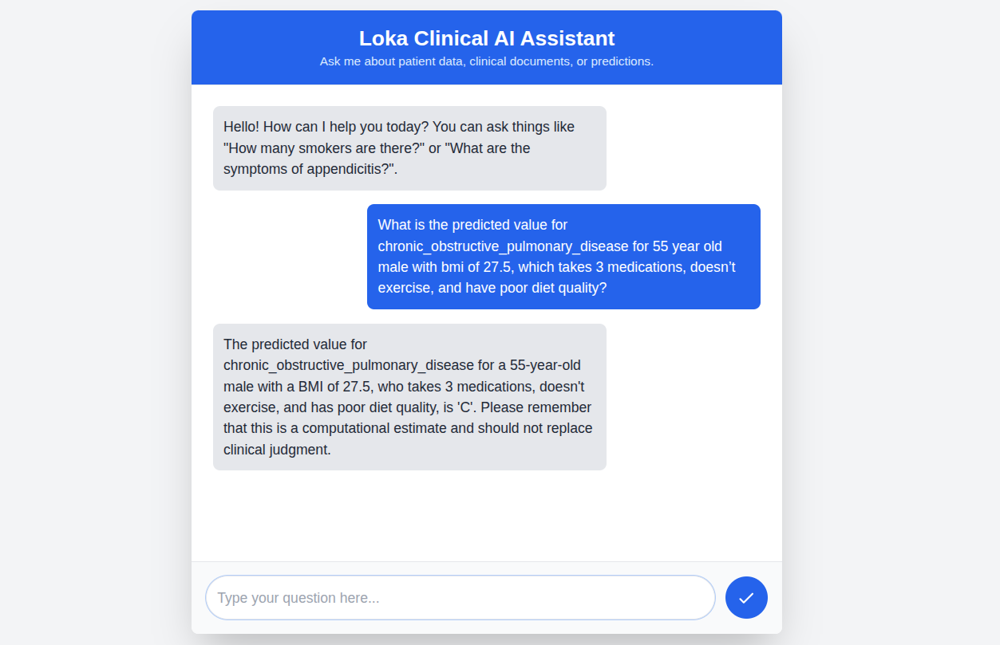

# Clinical AI Assistant

A multi-agent conversational healthcare analytics platform that combines patient data analysis, clinical document processing, and machine learning predictions through an intuitive chat interface.

## What This System Does

The Clinical AI Assistant helps healthcare professionals and researchers analyze patient data through natural language queries. Instead of writing complex database queries or manually searching through clinical documents, users can simply ask questions like "How many diabetic patients are over 65?" or "What are the common symptoms mentioned in respiratory cases?"

The system provides three main capabilities:
- **Patient Data Analysis**: Query demographics, medical history, and outcomes from structured datasets
- **Clinical Document Intelligence**: Search and summarize information from medical reports and notes
- **Predictive Analytics**: Generate risk predictions for conditions like COPD and liver enzyme levels

## Problems Identified During Development
- I had the impression that the CSV, anonymized patient records either is synthetic or does not contain variables relevant to the prediction of chronic_obstructive_pulmonary_disease, as the accuracy obtained during training was very low.
- The IDs of the CSV and the Markdown files do not match, what makes it difficult to generate more valuable insights.
- Two columns of the CSV (exercise_frequency and education level) had more than 50% missing values.
- In the CSV, the alanine_aminotransferase column has extreme values, that I understand not as outliers, but as errors.

## Project Structure

```
clinical-assistant/
├── app/
│   ├── agents/
│   │   ├── backend_agent.py
│   │   └── frontend_agent.py
│   ├── graph_db/
│   │   ├── connection.py
│   │   └── populate_graph.py
│   ├── models/
│   │   ├── predict.py
│   │   └── training.ipynb
│   ├── saved_models/
│   ├── templates/
│   │   └── index.html
│   └── main.py
├── data/
├── documents_data/
├── img/
├── .env
├── .env-example
├── .gitignore
├── Dockerfile
├── README.md
└── requirements.txt
```

## System Architecture

### How Information Flows Through the System

The Clinical AI Assistant uses a sophisticated multi-layered architecture to process and respond to healthcare queries:

#### Frontend Layer - User Interaction
The system starts with a clean web interface built with HTML, CSS, and JavaScript. Users type natural language questions into a chat interface that is familiar and intuitive. The frontend handles the visual presentation and sends questions to the backend via API calls to the front-end agent.

#### API Layer - Request Processing
A FastAPI server acts as the central hub, receiving user questions and routing them through the agent system. This layer handles authentication, request validation, and response formatting. It serves both the web interface and provides RESTful endpoints for external integrations.

#### Agent Orchestration - Intelligence Layer
The system uses a dual-agent architecture that mimics how healthcare professionals approach complex questions:

**Frontend Agent** acts as the "attending physician" - it receives the user's question, analyzes what type of information is needed, and determines which tools or data sources should be consulted. This agent handles query validation, tool selection, and response synthesis.

**Backend Agent** functions like a "specialist consultant" - it has access to three specialized tools and executes the actual data retrieval and analysis:

- **Graph QA Tool**: Generates database queries to answer statistical questions about patients
- **Document RAG Tool**: Searches through clinical documents using semantic similarity
- **Prediction Tool**: Runs machine learning models to predict patient outcomes

#### Data Storage - Multi-Modal Repository
The system stores information in Neo4j, which serves dual purposes:

**Graph Database Function**: Patient records, diagnoses, medications, and relationships are stored as an interconnected web of nodes and edges. This allows complex queries like "Find all patients over 50 with heart attack who are taking more than 3 medications."

**Vector Database Function**: Clinical documents are broken into searchable chunks and converted into mathematical embeddings that capture semantic meaning. This enables questions like "What symptoms are commonly reported with respiratory infections?"

#### External AI Services - Language Understanding
Google Vertex AI provides two critical capabilities:

**Large Language Model**: Powers the conversational interface, generates database queries, extracts entities from documents, and synthesizes final responses in natural language.

**Embedding Model**: Converts text into numerical vectors that enable semantic search across clinical documents, allowing the system to find relevant information even when exact keywords don't match.

### Data Processing Workflow

When the system starts up, it follows a specific data ingestion pipeline:

**Step 1 - Structured Data Loading**: Patient information from CSV files is loaded into Neo4j as Patient nodes with all their demographic and clinical properties. Diagnosis codes become separate nodes linked to patients.

**Step 2 - Document Processing**: Clinical documents in markdown format are processed by the language model to extract key entities like patient identifiers, symptoms, diagnoses, medications, and treatment plans. These entities are then linked to existing patient records in the graph.

**Step 3 - Vector Preparation**: The same clinical documents are split into searchable chunks, converted into embeddings, and stored alongside the graph data to enable semantic search capabilities.

**Step 4 - Model Integration**: Pre-trained machine learning models for predicting COPD risk and liver enzyme levels are loaded and made available through the prediction tool.

### Response Generation Process

When a user asks a question, the system follows this workflow:

1. **Query Analysis**: The frontend agent analyzes the question to understand what type of information is being requested
2. **Tool Selection**: Based on the query type, the agent selects the appropriate tool (graph queries for statistics, document search for qualitative information, or ML models for predictions)
3. **Data Retrieval**: The backend agent executes the selected tool, whether that's generating a database query, searching document embeddings, or running a prediction model
4. **Response Synthesis**: The results are processed and formatted into a natural language response that directly answers the user's question
5. **Delivery**: The final answer is sent back through the API to the web interface

This architecture allows the system to handle diverse healthcare queries while maintaining fast response times and accurate results. The separation between structured and unstructured data processing ensures that each type of question is handled by the most appropriate method.

## Quick Start

### Prerequisites
- Google Cloud Platform account with Vertex AI enabled
- Neo4j database instance (Neo4j AuraDB Free Tier recommended)
- Python 3.11 or higher
- Docker (for deployment)

### Environment Setup

1. **Clone the repository and create a virtual environment**:
```bash
git clone https://RubensZimbres/Loka
cd clinical-assistant
python3 -m venv venv
source venv/bin/activate
pip install -r requirements.txt
```

2. **Configure your environment variables** by creating a `.env` file:
```
GOOGLE_PROJECT_ID=your-gcp-project-id
GOOGLE_LOCATION=us-central1
NEO4J_URI=neo4j+s://your-instance.databases.neo4j.io
NEO4J_USERNAME=neo4j
NEO4J_PASSWORD=your-password
```

3. **Populate the database with your data**:
```bash
python3 -m app.graph_db.populate_graph
```

4. **Start the development server**:
```bash
python3 uvicorn app.main:app --reload --port 8080
```

5. **Open your browser** to `http://127.0.0.1:8080` and start asking questions

## Example Queries

### Patient Statistics
- "How many patients are smokers?"
- "What's the average age of diabetic patients?"
- "Show me patients with high BMI who were readmitted"

### Clinical Document Analysis
- "What symptoms are mentioned for respiratory conditions?"
- "Summarize treatment plans for heart disease patients"
- "What medications appear most frequently in discharge summaries?"

### Predictive Analytics
- "Predict COPD risk for a 60-year-old male smoker"
- "What would be the expected liver enzyme level for this patient profile?"

## Screenshots of the Neo4j Graph Database, Agent Reasoning and Chat Interface













## Deployment to Google Cloud

The system is designed for easy deployment to Google Cloud Run, as I have credits in Google Cloud, but it can also be deployed on ECS or EKS in AWS:

⚠️ The instance is scaling to zero, in order to save costs. The cold start may take 13 seconds before first interaction

```bash
gcloud auth login

gcloud config set project YOUR-PROJECT

gcloud artifacts repositories create clinical-assistant-repo \
    --repository-format=docker \
    --location=us-central1 \
    --description="Docker repository for clinical assistant service"

gcloud builds submit --tag us-central1-docker.pkg.dev/YOUR-PROJECT/clinical-assistant-repo/assistant-service:latest

gcloud run deploy clinical-assistant-service \
    --image=us-central1-docker.pkg.dev/YOUR-PROJECT/clinical-assistant-repo/assistant-service:latest \
    --platform=managed \
    --region=us-central1 \
    --allow-unauthenticated \
    --set-env-vars=GOOGLE_LOCATION=us-central1,NEO4J_URI="neo4j+s://XXXXXXXXXXXX",NEO4J_USERNAME=neo4j,NEO4J_PASSWORD="XXXXXXXXXXXXXXX" \
    --min-instances 0 \
    --max-instances 3 \
    --cpu 4 \
    --memory 8192Mi \
    --concurrency 10
```

After deployment, update the API URL in `templates/index.html` to point to your Cloud Run service.

The service is running at:

```
TO DO ADD HERE
```

## Deployment to AWS

```bash
aws ecr create-repository \
    --repository-name clinical-assistant-repo \
    --region us-east-1

aws ecr get-login-password --region us-east-1 | docker login --username AWS --password-stdin ACCOUNT_ID.dkr.ecr.us-east-1.amazonaws.com

docker tag clinical-assistant-service:latest ACCOUNT_ID.dkr.ecr.us-east-1.amazonaws.com/clinical-assistant-repo:latest

docker push ACCOUNT_ID.dkr.ecr.us-east-1.amazonaws.com/clinical-assistant-repo:latest

aws ecs create-cluster --cluster-name clinical-assistant-cluster

aws ecs register-task-definition --cli-input-json file://task-definition.json

aws ecs create-service \
    --cluster clinical-assistant-cluster \
    --service-name clinical-assistant-service \
    --task-definition clinical-assistant-task \
    --desired-count 1 \
    --launch-type "FARGATE" \
    --network-configuration "awsvpcConfiguration={subnets=SUBNET_ID,securityGroups=SECURITY_GROUP_ID,assignPublicIp=ENABLED}"
```

`task-definition.json`

```
{
    "family": "clinical-assistant-task",
    "networkMode": "awsvpc",
    "containerDefinitions": [
        {
            "name": "clinical-assistant-container",
            "image": "ACCOUNT_ID.dkr.ecr.us-east-1.amazonaws.com/clinical-assistant-repo:latest",
            "portMappings": [
                {
                    "containerPort": 8080,
                    "hostPort": 8080
                }
            ],
            "essential": true,
            "environment": [
                { "name": "GOOGLE_PROJECT_ID", "value": "YOUR_PROJECT" },
                { "name": "GOOGLE_LOCATION", "value": "us-central1" },
                { "name": "NEO4J_URI", "value": "neo4j+s://XXXXXXXXXXXX" },
                { "name": "NEO4J_USERNAME", "value": "neo4j" },
                { "name": "NEO4J_PASSWORD", "value": "XXXXXXXXXXXXXXX" }
            ]
        }
    ],
    "requiresCompatibilities": [
        "FARGATE"
    ],
    "cpu": "4096",
    "memory": "8192"
}
```

## Key Design Decisions

### Why Neo4j for Healthcare Data
Healthcare information is inherently interconnected. Patients have multiple diagnoses, take various medications, and are treated by different clinicians. Traditional relational databases require complex joins to explore these relationships, while Neo4j makes relationship traversal natural and efficient.

### Dual-Agent Architecture
The separation between frontend and backend agents creates a clean division of responsibilities. The frontend agent focuses on understanding user intent and orchestrating responses, while the backend agent specializes in data access and tool execution. This makes the system easier to maintain and extend.

### Hybrid Search Strategy
Different types of healthcare questions require different approaches. Statistical questions about patient populations are best answered through structured database queries, while questions about symptoms or treatment approaches benefit from semantic search through clinical literature. The system automatically selects the right approach based on the question type.

### LLM-Powered Entity Extraction
Clinical documents come in many formats and styles. Rather than building rigid parsers for each document type, the system uses language models to intelligently extract key information like patient identifiers, symptoms, and treatment plans. This approach is more flexible and can adapt to new document formats.

## Security and Privacy Considerations

This system handles sensitive healthcare data and should be deployed with appropriate security measures:

- Use authentication and authorization for production deployments
- Ensure Neo4j database is properly secured with strong passwords and network restrictions
- For the U.S., consider HIPAA (Health Insurance Portability and Accountability Act) compliance requirements if handling real patient data
- Implement audit logging for query tracking and compliance

## Troubleshooting

### Database Connection Issues
Verify your Neo4j credentials and ensure the database is accessible from your deployment environment. The most common issue is network connectivity between your application and the Neo4j instance.

### LLM API Errors
Ensure Vertex AI is enabled in your Google Cloud project and that your service account has the necessary permissions via IAM. Check that your environment variables are properly set. To test locally, run: `gcloud auth login`.

### Performance Optimization
For large datasets, consider processing documents in batches during ingestion. Monitor query performance and add database indexes for frequently accessed properties.

## Contributing

Contributions are welcome! Please ensure that any changes maintain the system's focus on healthcare data privacy and accuracy. Test thoroughly with representative data before submitting pull requests.

## Shared with:

- Bojan Ilijoski - @bojanilijoski
- Diogo Oliveira - @caldasdeoliveira
- Crhistian Cardona - @crhisto

## Limitations and Future Efforts

The current AI Health Assistant does not build charts, has no memory and the deployment has limited autoscaling.
If I had more time, I would focus on enhancing the assistant's intelligence and operational maturity.
I would implement a dynamic chart generation to visually represent statistical data and to add conversational memory. To ensure long-term reliability, I would establish a comprehensive system evaluation framework, build an automated model retraining & MLOps pipeline to keep predictions accurate, and integrate a human-in-the-loop feedback mechanism to allow the system to learn directly from clinician input.